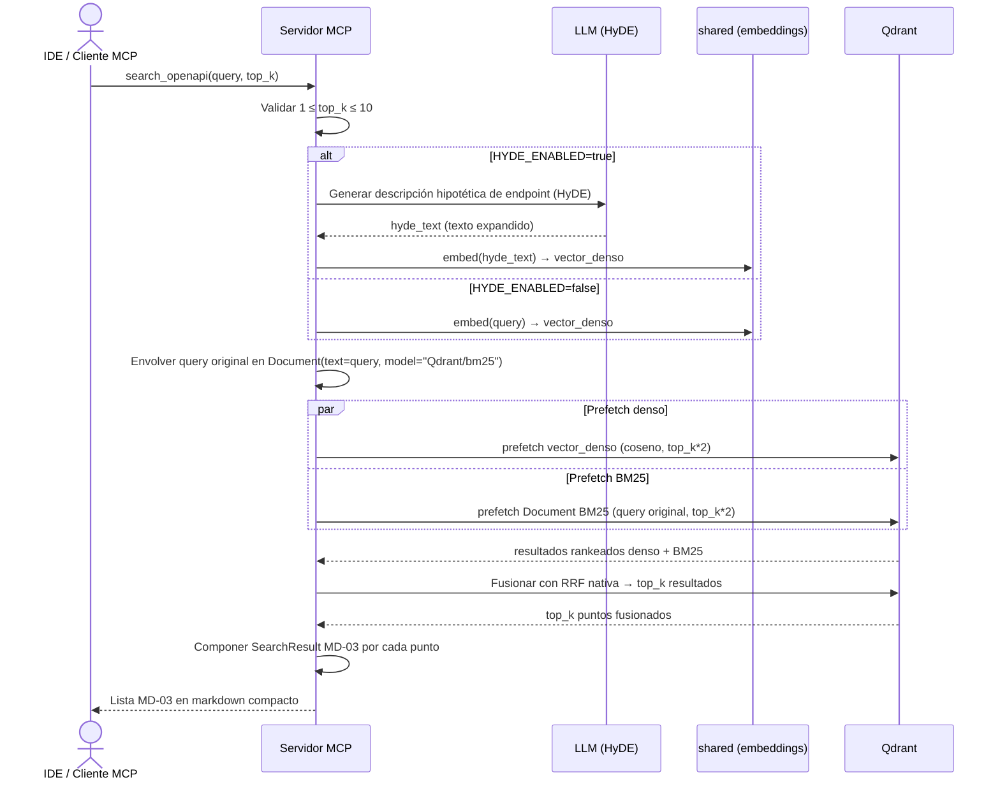
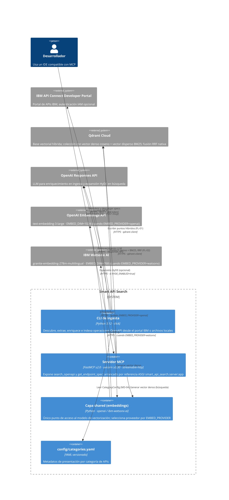

# Capability: Smart API Search

**Fecha de creación:** 2025-07-19
**Última actualización:** 2025-07-19

## Propósito

Búsqueda semántica híbrida sobre catálogos OpenAPI expuesta como servidor MCP HTTP, que permite a desarrolladores descubrir y consultar endpoints en lenguaje natural desde cualquier IDE compatible con el protocolo MCP. Queda fuera de alcance la gestión de usuarios del portal, la sincronización periódica automática y cualquier interfaz de usuario propia.

---

## Modelos de datos

<a id="md-01"></a>
### MD-01: QdrantPoint

DTO de transporte que representa un punto almacenado en la colección vectorial de Qdrant. Es la unidad de indexación del sistema: una operación OpenAPI (par `method` + `path`) con sus vectores y payload de metadatos.

| Campo | Tipo | Requerido | Descripción | Validaciones / restricciones |
| ----- | ---- | --------- | ----------- | ---------------------------- |
| id | string (UUID v4) | Sí | Identificador único del punto en Qdrant | Generado por el sistema; inmutable; derivado del `spec_ref` |
| vector_dense | float[] | Sí | Vector denso de similitud coseno | Dimensión igual a `EMBED_DIM` (1024 u openai; 768 para watsonx); ver [MD-05](#md-05) |
| vector_sparse | Document | Sí | Objeto documento para inferencia BM25 en el motor | Debe ser `Document(text=<texto>, model="Qdrant/bm25")`; nunca texto plano (ADR-010) |
| api_title | string | Sí | Título del spec OpenAPI fuente | — |
| api_version | string | No | Versión del spec OpenAPI | — |
| api_description | string | No | Descripción del spec OpenAPI | — |
| category | string | No | Categoría asignada desde `config/categories.yaml` | Si no hay metadatos de categoría, se usa el título del spec |
| method | string | Sí | Método HTTP de la operación | `GET` \| `POST` \| `PUT` \| `DELETE` \| `PATCH` \| `HEAD` \| `OPTIONS` \| `TRACE` |
| path | string | Sí | Path de la operación | Comienza con `/` |
| summary | string | No | Resumen de la operación | Cadena de respaldo: `summary` → primera línea `description` → `operationId` |
| description | string | No | Descripción completa de la operación | Texto limpio (sin macros, admoniciones ni espacios redundantes) |
| tags | string[] | No | Tags de la operación OpenAPI | Lista vacía si no se declaran |
| operationId | string | No | ID de la operación en el spec | — |
| environment | string | No | Nombre del entorno o servidor del spec | — |
| server_url | string | No | URL base del servidor (schemes+host+basePath en Swagger 2, o primer server en OAS3) | — |
| spec_format | string | Sí | Formato del spec original | `json` \| `yaml` |
| source_file | string | Sí | Identificador de la fuente | `portal:{slug}` (portal) o `file:{ruta_relativa}` (archivos); indexado como `keyword` (ADR-011) |
| spec_ref | string | Sí | Referencia única de la operación | Formato `source_file\|METHOD\|/path`; exactamente tres segmentos no vacíos; indexado como `keyword` (ADR-011) |
| enriched_text | string | No | Texto generado por LLM (250–400 palabras en inglés) | Incluye propósito, casos de uso, Keywords y preguntas de ejemplo; omitido con `--no-enrich` |
| raw_spec | string (JSON) | Sí | Fragmento crudo JSON de la operación | Incluye info del spec, servidor, formato, path, method y objeto operation completo |
| deeplink | string | No | URL del portal al detalle del endpoint | Vacía en modo archivos |

**Relaciones:** `QdrantPoint` compone [MD-02](#md-02) (como referencia por `spec_ref`) y es producido por el flujo [FL-01](#fl-01); es consumido por el flujo [FL-02](#fl-02).

---

<a id="md-02"></a>
### MD-02: RawSpec

DTO de transporte que contiene el fragmento JSON crudo de una operación OpenAPI extraída del spec original. Se almacena en el campo `raw_spec` de [MD-01](#md-01) y es la fuente de verdad para `get_endpoint_spec`.

| Campo | Tipo | Requerido | Descripción | Validaciones / restricciones |
| ----- | ---- | --------- | ----------- | ---------------------------- |
| info | object | Sí | Objeto `info` del spec (título, versión, descripción) | Copiado del spec original |
| servers | object[] | No | Servidores del spec (OAS3) o compuesto `schemes`+`host`+`basePath` (Swagger 2) | — |
| format | string | Sí | Formato del spec | `json` \| `yaml` |
| path | string | Sí | Path de la operación | Comienza con `/` |
| method | string | Sí | Método HTTP | Mayúsculas |
| operation | object | Sí | Objeto operation completo del spec (parámetros, respuestas, tags, etc.) | Sin modificación respecto al spec original |

**Relaciones:** Incluido como campo serializado en [MD-01](#md-01) (`raw_spec`).

---

<a id="md-03"></a>
### MD-03: SearchResult

DTO de salida de la herramienta `search_openapi`. Representa un endpoint recuperado y ordenado por RRF tras la búsqueda híbrida.

| Campo | Tipo | Requerido | Descripción | Validaciones / restricciones |
| ----- | ---- | --------- | ----------- | ---------------------------- |
| ranking | int | Sí | Posición en la lista de resultados | `1 ≤ ranking ≤ top_k`; `top_k` entre 1 y 10 |
| category | string | No | Categoría de la API | — |
| method | string | Sí | Método HTTP | Mayúsculas |
| path | string | Sí | Path de la operación | Comienza con `/` |
| summary | string | No | Resumen de la operación | — |
| description | string | No | Descripción | — |
| consolidated_definition | string | No | Definición consolidada de la operación (parámetros y body resumidos) | — |
| call_url | string | Sí | URL de llamada directa | `server_url` + `path`; NO es el deeplink ni la URL del portal |
| deeplink | string | No | URL del portal al detalle del endpoint | Vacía en modo archivos |
| spec_ref | string | Sí | Referencia única de la operación | Formato `source_file\|METHOD\|/path` |
| tags | string[] | No | Tags de la operación | — |
| source | string | Sí | Identificador de la fuente (`source_file`) | — |
| params | object[] | No | Parámetros normalizados + inferidos del template del path; se omiten los sin nombre | — |
| body | object | No | Esquema del body de la operación si aplica | — |

**Relaciones:** Producido por el flujo [FL-02](#fl-02).

---

<a id="md-04"></a>
### MD-04: CategoryConfig

Modelo de configuración leído del archivo versionado `config/categories.yaml`. Permite personalizar el título y la descripción de presentación por categoría de APIs.

| Campo | Tipo | Requerido | Descripción | Validaciones / restricciones |
| ----- | ---- | --------- | ----------- | ---------------------------- |
| category_key | string | Sí | Clave de la categoría (nombre de entrada en el YAML) | kebab-case o snake_case; coincide con el valor `category` del spec |
| title | string | No | Título de presentación de la categoría | Si ausente, se usa el título del spec |
| description | string | No | Descripción de presentación de la categoría | Si ausente, se usa la descripción del spec |

**Relaciones:** Consumido por el flujo [FL-01](#fl-01) al extraer metadatos de presentación de cada operación.

---

<a id="md-05"></a>
### MD-05: Settings

Configuración del sistema leída desde variables de entorno vía `python-dotenv`. Punto único de verdad de todos los parámetros de despliegue y del proveedor de embeddings activo.

| Campo | Tipo | Requerido | Descripción | Validaciones / restricciones |
| ----- | ---- | --------- | ----------- | ---------------------------- |
| QDRANT_URL | string (URL) | Sí | URL de la instancia Qdrant Cloud | Formato `https://…qdrant.io` |
| QDRANT_API_KEY | string | Sí | Clave API de Qdrant Cloud | — |
| QDRANT_COLLECTION | string | Sí | Nombre de la colección vectorial | — |
| EMBED_PROVIDER | enum | Sí | Proveedor de embeddings activo | `openai` \| `watsonx`; por defecto `openai` |
| EMBED_DIM | int | Sí | Dimensión del vector denso | `1024` si `EMBED_PROVIDER=openai`; `768` si `EMBED_PROVIDER=watsonx`; debe coincidir exactamente con el modelo activo; declarado una sola vez en `.env` |
| OPENAI_API_KEY | string | Cond. | API key de OpenAI | Requerida si `EMBED_PROVIDER=openai` |
| WATSONX_API_KEY | string | Cond. | API key de IBM Watsonx | Requerida si `EMBED_PROVIDER=watsonx` |
| WATSONX_PROJECT_ID | string | Cond. | Project ID de Watsonx | Requerida si `EMBED_PROVIDER=watsonx` |
| WATSONX_URL | string (URL) | Cond. | Endpoint de Watsonx | Requerida si `EMBED_PROVIDER=watsonx` |
| HYDE_ENABLED | bool | No | Activa la expansión HyDE antes del embedding denso | `true` por defecto; `false` deshabilita la llamada al LLM en búsqueda |
| IBM_PORTAL_HOST | string (URL) | Cond. | URL base del Developer Portal IBM | Requerida si `--source portal`; NO requerida en modo archivos |
| IBM_PORTAL_AUTH | bool | No | Activa autenticación IAM al portal | `true` \| `false`; si `false` no se solicita token IAM |
| IBM_TOKEN_URL | string (URL) | Cond. | URL de la API de tokens IAM | Requerida si `IBM_PORTAL_AUTH=true` |
| IBM_INSTANCE_ID | string | Cond. | Instance ID para el endpoint de tokens | Requerida si `IBM_PORTAL_AUTH=true` |
| IBM_API_KEY | string | Cond. | API key IAM | Requerida si `IBM_PORTAL_AUTH=true` |
| IBM_PORTAL_VERIFY_SSL | bool | No | Activa verificación de certificado SSL | `true` por defecto; `false` desactiva SSL verify y silencia avisos |
| LOCAL_SPECS_DIR | string (ruta) | Cond. | Directorio de specs locales | Requerido si `--source files` y sin `--specs-dir`; se resuelve a forma absoluta |
| MCP_HOST | string | No | Interfaz de escucha del servidor MCP | `127.0.0.1` por defecto |
| MCP_PORT | int | No | Puerto del servidor MCP | `8000` por defecto |
| MCP_PATH | string | No | Ruta base del endpoint MCP | `/mcp` por defecto |

**Relaciones:** Leído por la capa `smart_api_search.shared` (embeddings), la CLI de ingesta ([FL-01](#fl-01)) y el servidor MCP ([API-01](#api-01), [API-02](#api-02)).

---

## APIs / Endpoints (herramientas MCP)

Las herramientas MCP no son endpoints REST convencionales: son operaciones del protocolo MCP expuestas por el servidor FastMCP sobre transporte `streamable-http`. Se documentan con el contrato funcional que el servidor expone a los clientes MCP.

<a id="api-01"></a>
### API-01: search_openapi

- **Tipo:** Herramienta MCP
- **Transporte:** `streamable-http` · `POST {MCP_HOST}:{MCP_PORT}{MCP_PATH}`
- **Autenticación:** Sin autenticación (servidor local); acceso restringido por configuración de red
- **Descripción:** Busca endpoints de API en lenguaje natural usando el flujo híbrido HyDE + embedding denso + BM25 con fusión RRF. Devuelve hasta `top_k` resultados ordenados por relevancia en formato markdown compacto más contenido estructurado. NO devuelve el JSON OpenAPI completo.

**Request**

| Parámetro | Ubicación | Tipo | Requerido | Descripción |
| --------- | --------- | ---- | --------- | ----------- |
| query | body (MCP args) | string | Sí | Consulta en lenguaje natural |
| top_k | body (MCP args) | int | No | Número de resultados a devolver | `1 ≤ top_k ≤ 10`; por defecto `5` |

```json
{
  "query": "how to create a user account",
  "top_k": 5
}
```

**Responses**

| Código | Condición | Cuerpo |
|--------|-----------|--------|
| 200 (tool result) | Búsqueda completada | Lista de [MD-03](#md-03) en markdown compacto |
| tool_error | `top_k` fuera de rango o colección vacía | Mensaje de error estructurado MCP |

```json
[
  {
    "ranking": 1,
    "category": "User Management",
    "method": "POST",
    "path": "/users",
    "summary": "Create a new user",
    "call_url": "https://api.example.com/v1/users",
    "deeplink": "https://portal.example.com/apis/user-api/endpoints/POST/users",
    "spec_ref": "portal:user-api|POST|/users",
    "tags": ["users"],
    "source": "portal:user-api",
    "params": [],
    "body": { "required": ["email", "password"] }
  }
]
```

---

<a id="api-02"></a>
### API-02: get_endpoint_spec

- **Tipo:** Herramienta MCP
- **Transporte:** `streamable-http` · `POST {MCP_HOST}:{MCP_PORT}{MCP_PATH}`
- **Autenticación:** Sin autenticación (servidor local)
- **Descripción:** Recupera el fragmento OpenAPI completo de un endpoint específico por su `spec_ref`. Devuelve markdown más contenido estructurado con el fragmento OpenAPI ([MD-02](#md-02)), la URL de llamada y el deeplink. Un `spec_ref` inválido o no encontrado se trata como error de herramienta, nunca como excepción del servidor.

**Request**

| Parámetro | Ubicación | Tipo | Requerido | Descripción |
| --------- | --------- | ---- | --------- | ----------- |
| spec_ref | body (MCP args) | string | Sí | Referencia del endpoint en formato `source_file\|METHOD\|/path` |

```json
{
  "spec_ref": "portal:user-api|POST|/users"
}
```

**Responses**

| Código | Condición | Cuerpo |
|--------|-----------|--------|
| 200 (tool result) | Endpoint encontrado | [MD-02](#md-02) + `call_url` + `deeplink` en markdown estructurado |
| tool_error | `spec_ref` con formato inválido (≠ 3 segmentos no vacíos) | Mensaje de error estructurado MCP |
| tool_error | Punto no encontrado en la colección | Mensaje de error estructurado MCP; NO lanza excepción |

```json
{
  "spec_ref": "portal:user-api|POST|/users",
  "call_url": "https://api.example.com/v1/users",
  "deeplink": "https://portal.example.com/apis/user-api/endpoints/POST/users",
  "raw_spec": {
    "info": { "title": "User API", "version": "1.0.0" },
    "servers": [{ "url": "https://api.example.com/v1" }],
    "format": "json",
    "path": "/users",
    "method": "POST",
    "operation": {
      "summary": "Create a new user",
      "requestBody": { "required": true },
      "responses": { "201": { "description": "User created" } }
    }
  }
}
```

---

## Flujos / Procesos

<a id="fl-01"></a>
### FL-01: Ingesta (portal + archivos locales)

- **Disparador:** Ejecución de la CLI con `ingest --source portal|files [opciones]`
- **Actores / componentes:** CLI de ingesta, Developer Portal IBM (solo modo portal), sistema de archivos (modo archivos), LLM OpenAI Responses API (enriquecimiento), capa `shared` (embeddings), colección Qdrant
- **Resultado:** Colección Qdrant con puntos híbridos (vector denso + vector disperso BM25) por cada operación OpenAPI descubierta; el número de puntos es coherente con el número de operaciones extraídas

```mermaid
flowchart TD
    A([CLI ingest]) --> B{--source}
    B -- portal --> C[Autenticar IAM si IBM_PORTAL_AUTH=true]
    C --> D[Listar APIs con paginación GET /apis?page=N]
    D --> E[Obtener detalles en paralelo máx. 12 GET /apis/id]
    E --> F[Descargar attachment OpenAPI JSON/YAML]
    B -- files --> G[Resolver LOCAL_SPECS_DIR a ruta absoluta]
    G --> H[Leer recursivamente *.json *.yaml *.yml]
    F --> I[Parsear spec OpenAPI / Swagger 2.0]
    H --> I
    I --> J[Extraer operaciones por path+method]
    J --> K[Aplicar CategoryConfig MD-04]
    K --> L{Fuente ya indexada?}
    L -- Sí sin --force --> M[Omitir fuente]
    L -- No o --force --> N{--no-enrich?}
    N -- No --> O[LLM: generar texto enriquecido 250-400 palabras]
    N -- Sí --> P[Usar metadatos del spec directamente]
    O --> Q[Componer texto indexable: cabecera + texto enriquecido]
    P --> Q
    Q --> R[shared: embed texto → vector denso EMBED_DIM]
    Q --> S[Envolver texto original en Document text model=Qdrant/bm25]
    R --> T[Escribir punto en Qdrant con ambos vectores MD-01]
    S --> T
    T --> U[Verificar conteo final de puntos]
    U --> V([Fin: resumen de indexación])
    M --> V
```

**Pasos**

1. **CLI** lee configuración desde `Settings` ([MD-05](#md-05)) y valida que los parámetros requeridos estén presentes.
2. **CLI** llama a `ensure_collection()` de forma idempotente: crea la colección híbrida si no existe y crea los índices `keyword` en `source_file` y `spec_ref` si no existen (ADR-011).
3. **Modo portal:** CLI obtiene token IAM si `IBM_PORTAL_AUTH=true` con `POST {IBM_TOKEN_URL}/{IBM_INSTANCE_ID}/apikeys/token`; lista APIs con paginación `GET /apis?page=N` hasta cubrir el total del campo `count`; obtiene detalles en paralelo con máximo 12 peticiones en vuelo; descarga el attachment OpenAPI (JSON o YAML, tolerando BOM).
4. **Modo archivos:** CLI resuelve `LOCAL_SPECS_DIR` a ruta absoluta; descubre recursivamente archivos `.json`, `.yaml` y `.yml`.
5. CLI parsea cada spec (OAS3 o Swagger 2.0) y extrae las operaciones del campo `paths` (métodos HTTP estándar). Si el spec no tiene `paths`, genera un documento marcador para esa API.
6. CLI aplica la cadena de respaldo de texto: `summary` → primera línea `description` → `operationId` → descripciones de parámetros; aplica limpieza de texto (macros, admoniciones, espacios redundantes).
7. CLI lee [MD-04](#md-04) desde `config/categories.yaml`; si la categoría no tiene metadatos, usa el título y descripción del spec.
8. **Por cada fuente (source_file):** CLI consulta una sola vez si ya existen puntos con ese `source_file` y cachea la decisión. Sin `--force`: omite la fuente. Con `--force`: borra los puntos previos. Con `--dry-run`: prepara sin escribir.
9. Si `--no-enrich` está ausente: CLI llama al LLM (OpenAI Responses API) para generar el texto enriquecido de 250–400 palabras en inglés.
10. CLI compone el texto indexable: `[categoría | API | formato | método path | tags | base]` + texto enriquecido. El deeplink NO forma parte del texto indexable.
11. **`shared`:** genera el vector denso con el modelo y dimensión del proveedor activo (`EMBED_PROVIDER`, `EMBED_DIM`).
12. CLI envuelve el texto original de la operación en `Document(text=<texto>, model="Qdrant/bm25")` para la rama dispersa (ADR-010); nunca envía texto plano.
13. CLI escribe el punto en Qdrant con los dos vectores simultáneamente ([MD-01](#md-01)). Está prohibido escribir un punto con un solo vector.
14. Tras finalizar la ingesta, CLI verifica que el conteo de puntos en la colección sea coherente con el número de operaciones extraídas y muestra el resumen.

**Manejo de errores**

| Paso | Error posible | Comportamiento esperado |
| ---- | ------------- | ----------------------- |
| 1 | Falta `IBM_PORTAL_HOST` con `--source portal` | Fallo inmediato con mensaje claro, sin traza técnica |
| 1 | Falta `IBM_API_KEY` con `IBM_PORTAL_AUTH=true` | Fallo inmediato con mensaje claro |
| 1 | `config/categories.yaml` no existe o tiene sintaxis inválida | Fallo al arrancar, antes de procesar ningún spec; indica la ruta y la causa |
| 3 | Una API del portal no tiene attachment OpenAPI | Fallo con mensaje claro; no aborta el descubrimiento del resto |
| 3 | Error al obtener detalle de una API del portal | No aborta el descubrimiento; continúa con las demás APIs |
| 9 | LLM no disponible sin `--no-enrich` | Fallo con mensaje claro indicando que se puede usar `--no-enrich` |
| 13 | Error de escritura en Qdrant | Registrar el fallo con contexto del punto; continuar con la siguiente operación |

---

<a id="fl-02"></a>
### FL-02: Retrieval híbrido (HyDE + RRF)

- **Disparador:** Llamada a la herramienta MCP `search_openapi(query, top_k)` ([API-01](#api-01))
- **Actores / componentes:** Servidor MCP (FastMCP), capa `shared` (embeddings + HyDE), LLM OpenAI (solo si `HYDE_ENABLED=true`), colección Qdrant
- **Resultado:** Lista de hasta `top_k` resultados [MD-03](#md-03) ordenados por RRF, en markdown compacto



**Pasos**

1. **Servidor MCP** recibe la llamada `search_openapi(query, top_k)`; valida `1 ≤ top_k ≤ 10`.
2. Si `HYDE_ENABLED=true`: **Servidor MCP** llama al LLM para generar una descripción hipotética de endpoint (HyDE) a partir de `query`.
3. **`shared`** genera el vector denso a partir del texto expandido (HyDE activo) o de `query` directamente (HyDE desactivado), usando el mismo `EMBED_PROVIDER` y `EMBED_DIM` que la ingesta.
4. **Servidor MCP** envuelve `query` (texto original, sin modificar, sin HyDE) en `Document(text=query, model="Qdrant/bm25")` para la rama BM25.
5. **Servidor MCP** lanza en paralelo dos `prefetch` contra Qdrant: rama densa (vector coseno) y rama dispersa (objeto Document BM25).
6. Qdrant fusiona los rankings de ambas ramas con **RRF nativa** y devuelve los `top_k` puntos.
7. **Servidor MCP** compone un [MD-03](#md-03) por cada punto: extrae `ranking`, `category`, `method`, `path`, `summary`, `description`, `call_url` (`server_url`+`path`; nunca el deeplink), `deeplink`, `spec_ref`, `tags`, `source`, `params` (normalizados + inferidos del template del path; sin nombre omitidos) y `body`.
8. **Servidor MCP** devuelve la lista en formato markdown compacto más contenido estructurado.

**Manejo de errores**

| Paso | Error posible | Comportamiento esperado |
| ---- | ------------- | ----------------------- |
| 1 | `top_k` fuera de rango | `tool_error` con mensaje claro; no excepción del servidor |
| 2 | LLM no disponible con `HYDE_ENABLED=true` | `tool_error` indicando el fallo del LLM; no excepción del servidor |
| 5–6 | Colección vacía o no existe | Devuelve lista vacía sin excepción |
| 7 | `spec_ref` con formato inválido en un punto recuperado | Omitir ese resultado del ranking; loguear advertencia |

---

## Diagramas

<a id="dg-01"></a>
### DG-01: Diagrama de contenedores

- **Tipo:** Contenedores (C4)
- **Alcance:** Todos los contenedores del sistema y sus dependencias externas; no incluye el detalle interno de módulos ni la lógica de cada operación.



**Notas**

- El servidor MCP (`smart_api_search.server:app`) DEBE arrancarse siempre por referencia ASGI; nunca como `__main__` (ADR-013). El paquete `__init__.py` no debe reexportar la app.
- La capa `shared` es el único punto de acceso a los proveedores de embeddings (ADR-009). Ningún otro módulo puede importar directamente los clientes de OpenAI o Watsonx para generar embeddings.
- Cambiar `EMBED_PROVIDER` o `EMBED_DIM` invalida la colección Qdrant existente y obliga a reindexar todo el catálogo (ADR-014).
- El LLM de enriquecimiento (OpenAI Responses API) y el proveedor de embeddings son componentes externos independientes; es posible usar Watsonx para embeddings y OpenAI para el LLM.
- Los flujos detallados de los contenedores se encuentran en [FL-01](#fl-01) (ingesta) y [FL-02](#fl-02) (retrieval).

---

## Observaciones

- **MD-02 · MD-03:** El esquema interno del campo `operation` en `RawSpec` (MD-02) y el esquema detallado de `params` y `body` en `SearchResult` (MD-03) no están completamente especificados; dependen de la estructura del spec OpenAPI fuente. Se documentarán al implementar la extracción (US-002/TK asociadas).
- **MD-05:** Los valores exactos de timeout y reintentos para las llamadas HTTP al portal y a los proveedores de embeddings no están fijados en esta especificación. Quedan como laguna hasta la implementación de US-001 y US-003.
- **API-01 · API-02:** El formato de error estándar MCP (campo `tool_error`) sigue la especificación del protocolo MCP; no se define aquí un esquema de error propio del proyecto. Si el proyecto adopta un esquema de error propio, actualizar estas entradas.
- **FL-01:** El comportamiento exacto de `--recreate` con confirmación del operador (US-003/AC-011) no está detallado en el diagrama de flujo; se asume confirmación interactiva vía stdin.
- **DG-01:** No se incluye el diagrama de componentes interno de cada contenedor; se añadirá cuando las TK de implementación definan la estructura de módulos de `smart_api_search.server` y `smart_api_search.cli`.
